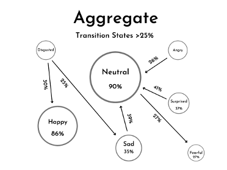
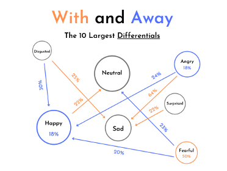

# A fun Multi-Modal Data Analytics Project: Exploring the Emotional Bond Between Humans and Dogs During Separataion

Are you a dog lover who's ever experienced separation anxiety from your furry friend? You're not alone! Our study delves into the emotional attachment between humans and dogs, using cutting-edge multi-modal data analytics technology.

We were interested about the relationship between people’s emotional states and electrothermal activity with how readily accessible they are from their pets when talking about them? How does looking at a picture of their dog affect, if at all, those variables? 

**Hypothesis**: Individuals living away from their dogs will express stronger and more negative (sad) emotions as well as demonstrate higher levels of electrothermal activity when recalling and telling a story about their dog.

## The Experiment

We recruited 8 participants, half living with their dogs and half away from them. We used storytelling to cue emotional responses, tracking their emotions and electrodermal activity (EDA) in real-time using [Empatica E4](https://e4.empatica.com/), a wristband tha monitors physiological signals. Participants shared stories about their dogs, and we analyzed their emotional transitions using Markov Chains.

All participants were monitored using **Face.API** and the **Empatica E4** while they went through our timed activity. We utilized a video with instructions and a timer on screen to pace the conversation.

Point of note that when you’re happy or neutral, you tend to stay that way.

Other emotions tend to converge back to happy. There were some sad moments and our participants noted that the wave of nostalgia made them feel that way (though it’s interesting that it is the withs that expressed that more physically).

## Key Findings
* Happy Memories: Participants mostly shared happy stories about their dogs, with a significant difference in happy expressions between those living away from their dogs (~27% difference).
* Emotional Transitions: Our Markov Chain analysis revealed that individuals tend to remain in neutral or happy states when talking about their dogs. However, those away from their dogs showed more surprised, disgusted, and angry expressions.
* EDA Insights: We found a negative correlation between EDA changes and dog proximity, indicating that individuals living with their dogs tend to have lower EDA changes.

## What else we wanted to do...
Our study demonstrates the potential of multi-modal data analytics in understanding the complex emotional relationships between humans and animals. Future research can expand on this by exploring other contexts, ages, and types of pets.
## Conclusion
The emotional attachment between humans and dogs is undeniable. By leveraging innovative technologies, we can gain a deeper understanding of this bond and its implications for our wellbeing. So, the next time you're away from your furry friend, remember that you're not alone in feeling that emotional tug!

> This is A Group Project I collaborated with Amy Chiu and Collin Liu, who share a passion for exploring the human-animal bond using innovative technologies.
> I thank all the participants and their cuuuuutteeeee companions.